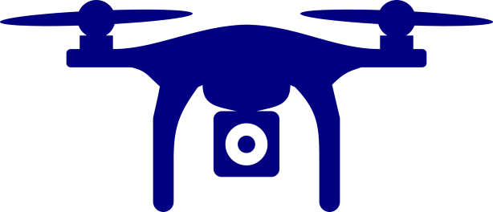

<h1 align="center"> Drone Simulator </h1>

  

## Overview

The main goal of this project is to develop a solution for a small drone to navigate indoor environments autonomously without collisions. The project involves a fully autonomous 2D drone simulator, aiming for realistic behavior using lidar sensors, a gyroscope, an optical flow sensor, and a speed sensor. Noise is added to sensor samples to enhance realism. The simulator includes a basic API for real-time information and manual control, as well as an area mapping feature.

**The project is classified into two parts:**

- **Part 1:** _Handling drone's sensor data._
  
  _Essentially in `DataSensor.java`._
  
- **Part 2:** _Implementing P.I.D controller for the drone._
  
  _Essentially in `VLD_PID.java`._
  
> The project is coded in **Java**.

## Classes - Brief & Insight

<h3 align="center"> DataSensor.java </h3>

------------------------------------------------------------------------------------------------------------------------------------------------

- **Attributes**: 
  - _`Drone drone`_
  - _`Map realmap`_
- **Functions**: 
  - _`DataSensor(Drone drone1)`_
  - _`double Forward_distance()`_
  - _`double Right_distance()`_
  - _`double Left_distance()`_
  - _`double Backward_distance()`_
  - _`String getInfoSensorData()`_

<h3 align="center"> VLD_PID.java </h3>

------------------------------------------------------------------------------------------------------------------------------------------------

- **Attributes**:
  - _`double kp`_
  - _`double ki`_
  - _`double kd`_
  - _`double d`_
  - _`double integral`_
  - _`double last_error`_
  - _`boolean first_run`_
- **Functions**:
  - _`VLD_PID(double p, double i, double d, double max_i)`_
  - _`double update(double error, double dt)`_
  - _`double constrain(double val, double max, double min)`_
  - _`void reset()`_

## Getting Started

When all files located inside eclipse or any other explorer we have the Maps folder which contains couple of maps with route and obstacles.
- Inside "SimulationWindow" in main we have map object with the path to any map you want to test.
- Inside "Drone" we have path to our image represents the drone itself.
After setting this up it is ready to launch.

## Sensors
- Lidar - check the distance between his spot forward and return the distance if hit, if not return 300 as max sample enabled.
In our project we set 3 lidars - one in front, second 90 degrees, third -90 degrees.
- Gyroscpoe - check the rotation of the drone. (0-360)
- Optical flow - check his location on map.
- Speed - max speed is 2m per second.

## Symbols 
- Yellow mark - mapped area.
- Black circle - his purpose to get some idea from where drone came and simply make some route that his passed.(for navigation)
- Red points - represents the wall point.
- Blue line - his whole route.

## API Description
The simple API includes buttons for:
- Start/Pause
- Speed Up/Down
- Spin by -+30, -+45, -+60, 90, and 180 degrees
- Toggle Map: Hides the real map to enter "real-time" vision
- Toggle AI: Enables/Disables AI

## Map Rule
If you wish to add custom map it has to be black/white pixels- black is wall/obstacle, white is safe pass.

## V2 update
- Added return home bottom, by clicking it drone will return to starting point.
- Directed Graph feature added. (JGrapht library required)

## Known bugs
- API might be in different place depends on the map.
- Sometimes drone might crash(hit the black pixels) specially in difficult obstacles.
- Sometimes may be indifferent parameters which causing some pixels override - solution is to re-run project.

## How Does The Simulator Look Like:

## How To Run

-
-
-
